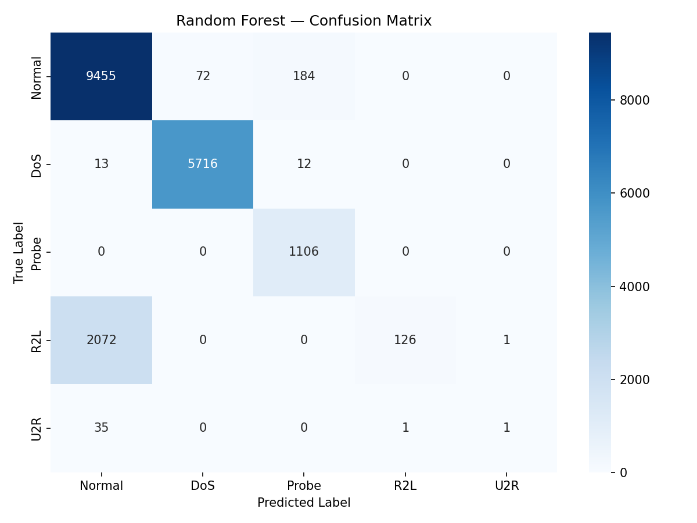
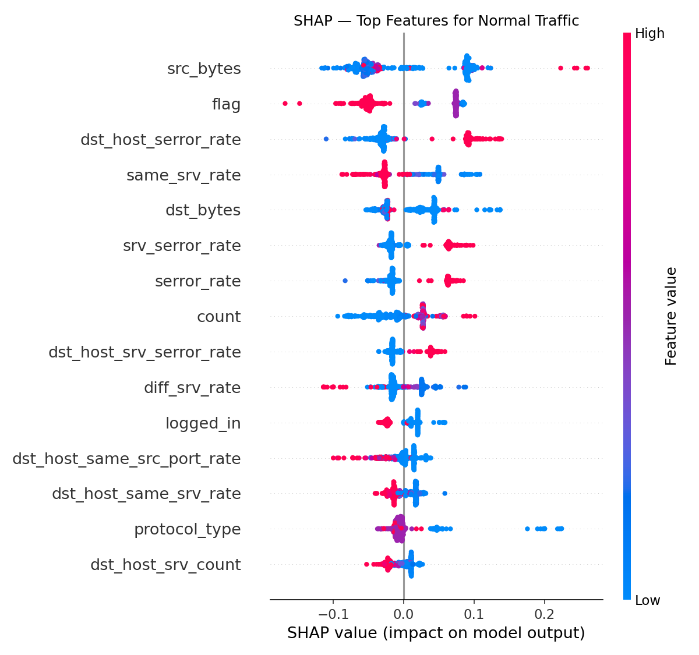

# Network Intrusion Detection with Machine Learning

A Random Forest classifier that detects network intrusions on NSL-KDD and maps predictions to MITRE ATT&CK techniques, served via FastAPI.

---

## Demo

Send a network connection record to the API, get back a prediction, confidence score, and MITRE ATT&CK mapping:

```bash
curl -X POST http://127.0.0.1:8000/predict \
  -H "Content-Type: application/json" \
  -d '{"features": [0,0,0,0,0,0,0,0,0,0,0,0,0,0,0,0,0,0,0,0,0,0,0,0,0,0,0,0,0,0,0,0,0,0,0,0,0,0,0,0,0]}'
```

```json
{
  "prediction": "Probe",
  "confidence": 0.44,
  "mitre": {
    "id": "T1046",
    "name": "Network Service Discovery"
  }
}
```

---

## Attack Families & MITRE ATT&CK Mapping

| Family  | Examples                        | MITRE Technique                          |
|---------|---------------------------------|------------------------------------------|
| DoS     | neptune, smurf, teardrop        | T1498 — Network Denial of Service        |
| Probe   | ipsweep, nmap, portsweep        | T1046 — Network Service Discovery        |
| R2L     | guess_passwd, warezclient       | T1078 — Valid Accounts (Remote Access)   |
| U2R     | buffer_overflow, rootkit        | T1068 — Exploitation for Privilege Escalation |
| Normal  | —                               | —                                        |

---

## Model Performance

Trained on 125,973 connections, evaluated on 18,794 unseen connections.

| Class  | Precision | Recall | F1   |
|--------|-----------|--------|------|
| Normal | 0.82      | 0.97   | 0.89 |
| DoS    | 0.99      | 1.00   | 0.99 |
| Probe  | 0.85      | 1.00   | 0.92 |
| R2L    | 0.99      | 0.06   | 0.11 |
| U2R    | 0.50      | 0.03   | 0.05 |

**DoS and Probe detection is near-perfect. R2L and U2R are intentionally hard, these attack families are rare by nature and notoriously difficult to detect on this benchmark.**

### Confusion Matrix


### SHAP — Feature Importance


Top drivers: src_bytes, flag, dst_host_serror_rate, same_srv_rate. Error rates and byte counts are the clearest indicators, consistent with manual SOC analysis.

---

## Project Structure

```
nid-ml/
├── main.py              # FastAPI app
├── ids_model.pkl        # Trained Random Forest model
├── scaler.pkl           # StandardScaler
├── requirements.txt
└── README.md
```

---

## Run Locally

```bash
git clone https://github.com/zeemanmemon/nid-ml
cd nid-ml
pip install -r requirements.txt
python -m uvicorn main:app --reload
```

API docs available at `http://127.0.0.1:8000/docs`

---

## Notebook

The full training pipeline (data loading, preprocessing, model training, evaluation, SHAP) is available as a Google Colab notebook:

[](https://colab.research.google.com/drive/1fCsNk_gROYaIQkokw6PN0YBi0OLxkPTY?usp=sharing)

---

## Tech Stack

- **Python 3.12**
- **scikit-learn** — Random Forest, preprocessing, evaluation
- **pandas** — data manipulation
- **SHAP** — model explainability
- **FastAPI + Uvicorn** — REST API
- **NSL-KDD dataset** — benchmark intrusion detection dataset

---

## Dataset

[NSL-KDD](https://www.unb.ca/cic/datasets/nsl.html) - An improved version of the KDD Cup 1999 dataset, widely used for network intrusion detection research.
